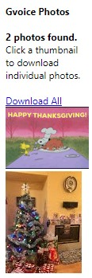

Google Voice photo download
=====================
Chrome browser extension - [code](https://github.com/helgasoft/Chrome-Ext-Gvoice/)

## Problem
Your platform is Windows with the latest Chrome browser and you have a [Google Voice](https://voice.google.com/messages) phone number.
Google Voice supports send/receive text messages with image/photo attachments. Downloading received photos, however, is inconvenient. You can download one image at a time with **minimum 5 clicks** - open, right-click, Save image as, Save, return arrow(GoBack).

Two additional issues are that  
* any **date information** has to be manually associated with the photos, as that information is neither included in the filename nor the metadata  
* there is no easy way to **download all photos** of a thread with one click
  
 

## Solution

This extension shows all photos of a thread (*conversation*) in a compact,
easy-to-scroll list. It provides a quick one-click download for **all** images currently in view, and a list of clickable thumbnails to download **individual** images. Images are named according to the date they were sent or received.  
Downloading photos and images sent to your Google Voice number becomes much easier.   

  

## Installation:
 * [download ZIP](gvphoto.zip?raw=true) ►  unzip to a local folder
 * Chrome ►  Menu  ►  More Tools ►  Extensions (or just copy link *chrome://extensions/* into the address bar)
 * Set upper-right "Developer Mode" to On and keep it that way
 * Click button "Load Unpacked"
 * Select the folder with the files and hit Ok ► Chrome will show icon  in the extensions menu  
    

 

Notes

 * Only photos currently loaded are displayed. To see older photos, scroll back to the older photos
before hitting the extension button.
 * Legacy Google Voice cannot use this extension
 * Chrome on Mobile Devices does not support extensions
 * Other extensions like AdGuard AdBlocker could disable downloads

&emsp;
